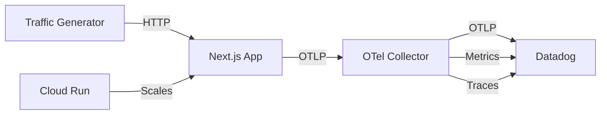

# Gemini Cost Guardian

**Gemini Cost Guardian**: A production-ready end-to-end LLM observability solution for Vertex AI/Gemini, with Datadog integration for comprehensive monitoring, alerting, and cost control.

Datadog Org: N/A  
Datadog Site: us5.datadoghq.com

## Architecture



## Prerequisites

- Google Cloud SDK (`gcloud`)
- Docker and Docker Compose
- Node.js 18+
- Datadog API and App keys
- GCP Project with:
    - Vertex AI API enabled
    - Service account with Vertex AI User and Cloud Run Admin roles
    - Artifact Registry API enabled

## Local Development

### 1. Install Dependencies

```bash
npm install
```

### 2. Set Up Environment Variables

Copy the example environment file and update the values:

```bash
cp .env.local.example .env.local
```

Edit `.env.local` with your configuration:

```env
# Datadog (US5)
DD_API_KEY=__DD_API_KEY__
DD_APP_KEY=__DD_APP_KEY__

OTEL_SERVICE_NAME=gemini-cost-guardian
OTEL_RESOURCE_ATTRIBUTES=service.version=0.1.0,deployment.environment=dev

OTEL_EXPORTER_OTLP_TRACES_ENDPOINT=http://localhost:4318/v1/traces
OTEL_EXPORTER_OTLP_METRICS_ENDPOINT=http://localhost:4318/v1/metrics
OTEL_EXPORTER_OTLP_METRICS_TEMPORALITY_PREFERENCE=Delta

# Vertex AI / Gemini
GOOGLE_CLOUD_PROJECT=gemini-cost-guardian-2025
GOOGLE_CLOUD_LOCATION=global
GOOGLE_GENAI_USE_VERTEXAI=true
GCG_GEMINI_MODEL=gemini-2.5-flash
```

### 3. Run the Application

Start the Next.js development server:

```bash
npm run dev
```

### 4. Run the OTel Collector

Set your Datadog environment variables and run the OpenTelemetry Collector:

```bash
export DD_SITE=us5.datadoghq.com
export DD_API_KEY=your-datadog-api-key
```

In a separate terminal, start the OpenTelemetry Collector with Docker:

```bash
MSYS_NO_PATHCONV=1 MSYS2_ARG_CONV_EXCL="*" docker run --rm --name gcg-otelcol   -p 4318:4318 -p 4317:4317 -p 13133:13133   -e DD_SITE="$DD_SITE"   -e DD_API_KEY="$DD_API_KEY"   -v "$(pwd)/otelcol/collector.yaml:/etc/otelcol-contrib/config.yaml:ro"   otel/opentelemetry-collector-contrib:0.95.0   --config=/etc/otelcol-contrib/config.yaml
```

## Deployment to Cloud Run

### 1. Deploy to Cloud Run

```bash
gcloud run deploy gemini-cost-guardian --source . --region us-central1 --allow-unauthenticated
```

### 2. Verify Deployment

Get the service URL:

```bash
gcloud run services describe gemini-cost-guardian --region=us-central1 --format='value(status.url)'
```

## Datadog Navigation

### Viewing Telemetry

- **Traces**: Navigate to APM > Traces in Datadog
- **Metrics**: Go to Metrics > Explorer in Datadog
- **Dashboard**: Access the "Gemini Cost Guardian - Judge View" dashboard
- **SLOs**: Monitor under Service Level Objectives

## Demo

### 1. Generate Traffic

```bash
cp traffic/.env.example traffic/.env
```

Edit `traffic/.env` with your configuration:

```env
# Target (deployed Cloud Run URL)
GCG_BASE_URL=https://gemini-cost-guardian-680500283174.us-central1.run.app/
GCG_TRAFFIC_SESSION_ID="demo-2025-12-26"

# Generator behavior
GCG_RPS=2
GCG_MAX_INFLIGHT=12
GCG_REQUEST_TIMEOUT_MS=30000

# Sustain time (set >= your monitor window reality)
# If any monitor is last_5m, use 180000–300000.
GCG_SUSTAIN_MS=120000

# Probe targets (should match what your scenarios actually emit)
GCG_LATENCY_TARGET_MS=3000

# IMPORTANT: your security scenario thresholds are higher than the monitor thresholds.
# If you want the generator to "prove" the security scenario itself, use these:
GCG_TOOLCALL_TARGET=60
GCG_COST_TARGET_USD=0.25
```

Run the traffic generator against your Cloud Run URL:

```bash
npx tsx -r dotenv/config traffic/generate_traffic.ts dotenv_config_path=./traffic/.env
```

### 2. Monitor Alerts

The following monitors should trigger during the demo:

1. **Error Rate Spike** - When error scenarios are triggered
2. **Latency Regression** - When response times exceed thresholds
3. **Cost Spike** - When token usage increases significantly
4. **Security Events** - When security scenarios are detected

Incidents will appear in the Datadog Incidents dashboard and notify the configured on-call team.

## Datadog Organization

This project is configured to send telemetry to Datadog organization: **hackathon-org**

## License

MIT
